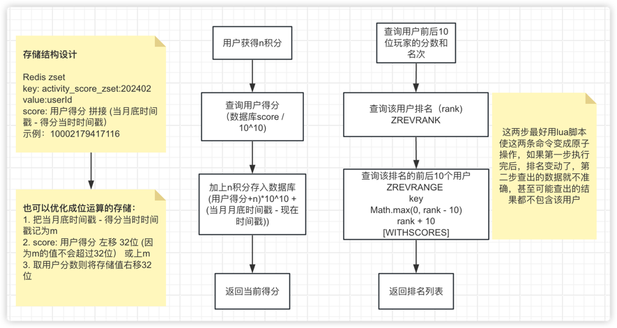

# demo

你开发了⼀个游戏，日活跃用户在10万⼈以上。 请设计⼀个活动排行榜系统。
- 在每月活动中，玩家得到的活动总分为 0 到 10000 之间的整数。
- 在每月活动结束之后，需要依据这⼀活动总分，从高到低为玩家建立排行榜。
- 如果多位玩家分数相同，则按得到指定分数顺序排序，先得到的玩家排在前面。
- 系统提供玩家名次查询接口，玩家能够查询自己名次前后10位玩家的分数和名次。
- 请使用UML图或线框图表达设计，关键算法可使用流程图或伪代码表达。 
- 如果玩家分数，触发时间均相同，则根据玩家等级，名字依次排序，此情景如何设计？ （这条属于额外的答题内容， 给出思路就可以）

设计如图：

代码见 demo/src/main/java/org/example/Activity.java

如果分数相同，还需要根据玩家等级、名字依次排序，可以将等级的信息继续在zset的score后面做拼接，但是可能会超出redis的存储范围，所以选择位运算的存储方式，并且根据实际需求考虑把毫秒变成秒，这样10000分数最多占14位，距离月底时间戳秒为单位最多占22位，redis最大应该存54位，多余18位，可以拿最后14位存储等级（可最大支持16383级），这样就实现了根据等级排序。

最后名字的维度，不知实际需求的名字排名规则，可以将前三个维度的排名信息查出来之后，判断如果有用户数据库存储score完全相同，就查询他们的名字在内存里手动排序。